# 🚀 Claude Code MCP Enhanced - Quick Start Guide

Get up and running with Claude Code MCP Enhanced in under 5 minutes!

## Prerequisites

1. Node.js v20+ installed
2. Claude CLI installed and configured ([install guide](https://claude.ai/cli))
3. Claude Desktop or another MCP-compatible client

## 🎯 Fastest Setup (GitHub URL)

1. **Add to your MCP configuration file:**

   ```json
   {
     "mcpServers": {
       "claude-code-mcp-enhanced": {
         "command": "npx",
         "args": ["github:grahama1970/claude-code-mcp-enhanced"],
         "env": {
           "MCP_CLAUDE_DEBUG": "false"
         }
       }
     }
   }
   ```

2. **Save the file to the correct location:**
   - Claude Desktop: `~/Library/Application Support/Claude/claude_desktop_config.json` (macOS)
   - Cursor: `~/.cursor/mcp.json`
   - Windsurf: `~/.codeium/windsurf/mcp_config.json`

3. **Restart your MCP client** (Claude Desktop, Cursor, etc.)

4. **Test it's working:**
   ```
   Use the claude_code tool to create a file test.txt with content "Hello MCP!"
   ```

## 🛠️ Available Tools

### 1. claude_code
Execute Claude Code commands with full system access:
```json
{
  "prompt": "Create a new Python file hello.py that prints 'Hello World'",
  "workFolder": "/path/to/project"
}
```

### 2. health
Check server status:
```json
{
  "toolName": "claude_code:health"
}
```

### 3. task_amender
Ensures task markdown files conform to the standard template structure:
```json
{
  "markdownPath": "/path/to/task.md",
  "outputPath": "/path/to/amended_task.md"
}
```

### 4. convert_task_markdown
**Automatically converts human-readable markdown task lists into MCP-compliant JSON commands that Claude Code executes sequentially!**

```mermaid
graph TD
    A[📝 Multi-Task Markdown] -->|🔄 task_amender| B[✅ Standardized Task]
    B -->|🔄 convert_task_markdown| C{✓ Valid Format?}
    C -->|❌ Error| D[📑 Fix Instructions]
    D -->|Return to| A
    C -->|✅ Success| E[📋 MCP Task List]
    E -->|Execute| F[⚡ Claude Task #1]
    F -->|Complete| G[⚡ Claude Task #2]
    G -->|Complete| H[⚡ Claude Task #3]
    H -->|Complete| I[... More Tasks ...]
    I -->|Execute| J[⚡ Claude Task #N]
    J -->|Complete| K[✅ All Tasks Done]
    
    style A fill:#FF9800,stroke:#fff,stroke-width:2px,color:#fff
    style B fill:#00BCD4,stroke:#fff,stroke-width:2px,color:#fff
    style C fill:#9C27B0,stroke:#fff,stroke-width:2px,color:#fff
    style D fill:#F44336,stroke:#fff,stroke-width:2px,color:#fff
    style E fill:#2196F3,stroke:#fff,stroke-width:2px,color:#fff
    style F fill:#FFC107,stroke:#fff,stroke-width:2px,color:#fff
    style G fill:#FFC107,stroke:#fff,stroke-width:2px,color:#fff
    style H fill:#FFC107,stroke:#fff,stroke-width:2px,color:#fff
    style I fill:#9E9E9E,stroke:#fff,stroke-width:2px,color:#fff
    style J fill:#FFC107,stroke:#fff,stroke-width:2px,color:#fff
    style K fill:#4CAF50,stroke:#fff,stroke-width:2px,color:#fff
```



This powerful tool transforms your TODO lists into executable code operations:
```json
{
  "markdownPath": "/path/to/tasks.md",
  "outputPath": "/path/to/output.json",
  "autoAmend": true
}
```

**What it does:**
- First amends the task to ensure it conforms to the template (if autoAmend is true)
- Takes a markdown file with human-readable tasks (like "Create user authentication module")
- Converts them to exact, executable commands (like `cd /project && python create_auth.py`)
- Outputs MCP-compliant JSON that Claude Code can run step-by-step
- No more manual command translation - just write what you want done!

### 5. task_to_json
Combined tool that both amends and converts a task in one operation:
```json
{
  "markdownPath": "/path/to/task.md",
  "outputPath": "/path/to/output.json",
  "autoAmend": true
}
```

## 📝 Basic Examples

### Create a file
```
Use claude_code to create index.html with a basic HTML5 template
```

### Run a git operation
```
Use claude_code to commit all changes with message "Initial commit"
```

### Amend a task to conform to the template
```
Use task_amender to amend my tasks.md file
```

### Convert a task list to executable commands
```
Use convert_task_markdown to convert my tasks.md file to MCP commands
```

### Amend and convert in one step
```
Use task_to_json to convert my tasks.md file to MCP commands with auto-amendment
```

**Example: Your markdown file says:**
```markdown
# Task 001: User Authentication

## Implementation Tasks

### Task 1: Setup Authentication Module

- Step 1: Create auth module files
- Step 2: Implement login functionality
- Step 3: Add password hashing

### Task 2: Create API Endpoints

- Step 1: Add login endpoint
- Step 2: Add logout endpoint
- Step 3: Add password reset endpoint

### Task 3: Write Tests

- Step 1: Write unit tests
- Step 2: Write integration tests
- Step 3: Test edge cases
```

**First the amender adds missing sections:**
```markdown
# Task 001: User Authentication ⏳ Not Started

**Objective**: [REPLACE WITH SPECIFIC OBJECTIVE]

**Requirements**:
1. [REPLACE WITH SPECIFIC REQUIREMENT]
2. [REPLACE WITH SPECIFIC REQUIREMENT]
3. [ADD MORE REQUIREMENTS AS NEEDED]

## Overview

[REPLACE WITH OVERVIEW OF THE TASK]

**IMPORTANT**: 
1. Each sub-task MUST include creation of a verification report in `/docs/reports/` with actual command outputs and performance results.
2. Task 4 (Final Verification) enforces MANDATORY iteration on ALL incomplete tasks. The agent MUST continue working until 100% completion is achieved - no partial completion is acceptable.

## Implementation Tasks

### Task 1: Setup Authentication Module ⏳ Not Started

**Priority**: MEDIUM | **Complexity**: MEDIUM | **Impact**: HIGH

**Execution Mode**: SEQUENTIAL

**Implementation Steps**:
- [ ] Step 1: Create auth module files
- [ ] Step 2: Implement login functionality
- [ ] Step 3: Add password hashing

...
```

**Then the converter transforms to JSON:**
```json
[
  {
    "tool": "claude_code",
    "arguments": {
      "prompt": "cd /project && # Task: Setup Authentication Module\n\n1. Create auth module files\n2. Implement login functionality...",
      "workFolder": "/project"
    }
  },
  {
    "tool": "claude_code",
    "arguments": {
      "prompt": "cd /project && # Task: Create API Endpoints\n\n1. Add login endpoint\n2. Add logout endpoint...",
      "workFolder": "/project" 
    }
  },
  // ... more tasks
]
```

**Claude Code then executes each task sequentially!** 🚀

## 🔧 Common Issues

1. **"Command not found"**: Make sure Node.js v20+ is installed
2. **Permission errors**: Run `claude --dangerously-skip-permissions` once first
3. **Tool not showing**: Restart your MCP client after configuration
4. **Task amendment fails**: Ensure your task has a valid title formatted as `# Task NNN: Title`

## 📚 Next Steps

- Read the [full documentation](README.md) for advanced features
- Learn about the [Task Amender](docs/task_amender_guide.md) capabilities
- Explore the [Task Template Workflow](docs/task_template_workflow.md)
- Check out [example task definitions](docs/tasks/)

## 🆘 Need Help?

- [GitHub Issues](https://github.com/grahama1970/claude-code-mcp-enhanced/issues)
- [Full Documentation](README.md)
- [Troubleshooting Guide](README.md#-troubleshooting)

---
*Ready in 5 minutes, powerful for a lifetime! 🚀*